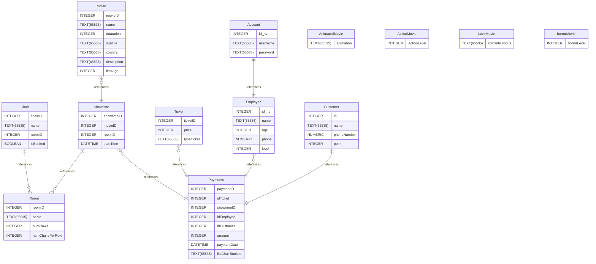

# Cinema-Management
Creat an app to manage cinema for THE BOSS :D and order ticket
  
THÀNH VIÊN NHÓM AVANCER:
+ 6451071008 - TRẦN THỊ MỸ DUNG
+ 6451071024 - ĐẶNG NGỌC HIẾU
+ 6451071067 - LÊ CÔNG TÀI

**
#Database**
#
## Summary

- [Introduction](#introduction)
- [Database Type](#database-type)
- [Table Structure](#table-structure)
	- [Movie](#Movie)
	- [Showtime](#Showtime)
	- [Room](#Room)
	- [Chair](#Chair)
	- [Ticket](#Ticket)
	- [Payments](#Payments)
	- [Employee](#Employee)
	- [Account](#Account)
	- [AnimatedMovie](#AnimatedMovie)
	- [ActionMovie](#ActionMovie)
	- [LoveMovie](#LoveMovie)
	- [horrorMovie](#horrorMovie)
	- [Customer](#Customer)
- [Relationships](#relationships)
- [Database Diagram](#database-Diagram)

## Introduction

## Database type

- **Database system:** SQLite
## Table structure

### Movie

| Name        | Type          | Settings                      | References                    | Note                           |
|-------------|---------------|-------------------------------|-------------------------------|--------------------------------|
| **movieID** | INTEGER | 🔑 PK, not null , unique, autoincrement | Movie_movieID_fk | |
| **name** | TEXT(65535) | not null  |  | |
| **duaration** | INTEGER | not null  |  | |
| **subtitle** | TEXT(65535) | not null  |  | |
| **country** | TEXT(65535) | not null  |  | |
| **description** | TEXT(65535) | not null  |  | |
| **limitAge** | INTEGER | not null  |  | | 

### Showtime

| Name        | Type          | Settings                      | References                    | Note                           |
|-------------|---------------|-------------------------------|-------------------------------|--------------------------------|
| **showtimeID** | INTEGER | 🔑 PK, not null , unique, autoincrement | Showtime_showtimeID_fk | |
| **movieID** | INTEGER | not null  |  | |
| **roomID** | INTEGER | not null  | Showtime_roomID_fk | |
| **startTime** | DATETIME | not null  |  | | 

### Room

| Name        | Type          | Settings                      | References                    | Note                           |
|-------------|---------------|-------------------------------|-------------------------------|--------------------------------|
| **roomID** | INTEGER | 🔑 PK, not null , unique, autoincrement |  | |
| **name** | TEXT(65535) | not null  |  | |
| **numRows** | INTEGER | not null  |  | |
| **numChairsPerRow** | INTEGER | not null  |  | | 

### Chair

| Name        | Type          | Settings                      | References                    | Note                           |
|-------------|---------------|-------------------------------|-------------------------------|--------------------------------|
| **chairID** | INTEGER | 🔑 PK, not null , unique, autoincrement | Chair_chairID_fk | |
| **name** | TEXT(65535) | not null  |  | |
| **roomID** | INTEGER | not null  |  | |
| **isBooked** | BOOLEAN | not null  |  | | 

### Ticket

| Name        | Type          | Settings                      | References                    | Note                           |
|-------------|---------------|-------------------------------|-------------------------------|--------------------------------|
| **ticketID** | INTEGER | 🔑 PK, not null , unique, autoincrement | Ticket_ticketID_fk | |
| **price** | INTEGER | not null  |  | |
| **typeTicket** | TEXT(65535) | not null  |  | | 

### Payments

| Name        | Type          | Settings                      | References                    | Note                           |
|-------------|---------------|-------------------------------|-------------------------------|--------------------------------|
| **paymentID** | INTEGER | 🔑 PK, not null , unique, autoincrement |  | |
| **idTicket** | INTEGER | not null  |  | |
| **showtimeID** | INTEGER | not null  |  | |
| **idEmployee** | INTEGER | not null  |  | |
| **idCustomer** | INTEGER | not null  |  | |
| **amount** | INTEGER | not null  |  | |
| **paymentDate** | DATETIME | not null  |  | |
| **listChairBooked** | TEXT(65535) | not null  |  | | 

### Employee

| Name        | Type          | Settings                      | References                    | Note                           |
|-------------|---------------|-------------------------------|-------------------------------|--------------------------------|
| **id_nv** | INTEGER | 🔑 PK, not null , unique, autoincrement | Employee_id_nv_fk | |
| **name** | TEXT(65535) | not null  |  | |
| **age** | INTEGER | not null  |  | |
| **phone** | NUMERIC | not null  |  | |
| **level** | INTEGER | not null  |  | | 

### Account

| Name        | Type          | Settings                      | References                    | Note                           |
|-------------|---------------|-------------------------------|-------------------------------|--------------------------------|
| **id_nv** | INTEGER | 🔑 PK, not null , unique, autoincrement | Account_id_nv_fk | |
| **username** | TEXT(65535) | not null  |  | |
| **password** | TEXT(65535) | not null  |  | | 

### AnimatedMovie

| Name        | Type          | Settings                      | References                    | Note                           |
|-------------|---------------|-------------------------------|-------------------------------|--------------------------------|
| **animation** | TEXT(65535) | 🔑 PK, not null , unique |  | | 

### ActionMovie
nhẹ, trung bình, cực đoạn
| Name        | Type          | Settings                      | References                    | Note                           |
|-------------|---------------|-------------------------------|-------------------------------|--------------------------------|
| **actionLevel** | INTEGER | 🔑 PK, not null , unique, autoincrement |  | | 

### LoveMovie

| Name        | Type          | Settings                      | References                    | Note                           |
|-------------|---------------|-------------------------------|-------------------------------|--------------------------------|
| **romanticFocus** | TEXT(65535) | 🔑 PK, not null , unique |  | | 

### horrorMovie

| Name        | Type          | Settings                      | References                    | Note                           |
|-------------|---------------|-------------------------------|-------------------------------|--------------------------------|
| **horrorLevel** | INTEGER | 🔑 PK, not null , unique, autoincrement |  | | 

### Customer

| Name        | Type          | Settings                      | References                    | Note                           |
|-------------|---------------|-------------------------------|-------------------------------|--------------------------------|
| **id** | INTEGER | 🔑 PK, not null , unique, autoincrement | Customer_id_fk | |
| **name** | TEXT(65535) | not null  |  | |
| **phoneNumber** | NUMERIC | not null  |  | |
| **point** | INTEGER | not null  |  | | 

## Relationships

- **Movie to Showtime**: one_to_many
- **Showtime to Room**: many_to_one
- **Chair to Room**: many_to_one
- **Customer to Payments**: one_to_one
- **Employee to Payments**: one_to_many
- **Ticket to Payments**: one_to_many
- **Showtime to Payments**: one_to_many
- **Account to Employee**: one_to_one

## Database Diagram

